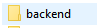

# Projeto-JMeduca

Projeto baseado em um sistema de cadastro, controle e analise de dados escolares referentes a series, turmas, alunos e notas.

A aplicação permite:

*   Cadastro de alunos;
*   Cadastro de turmas;
*   Registro de notas;
*   Verificação de alunos aprovados/reprovados;
*   Controle de alunos
*   Permissão de atualização de dados.

# Tecnologias utilizadas
No projeto foram utilizadas as seguintes tecnologias;

*   ReactJS
*   NextJS
*   NodeJS
*   Scss
*   HTML
*   Axios
*   Prisma

# Abrindo e iniciando projeto

1. Utilie o comando GitClone em um repositório no seu CMD:

        git clone https://github.com/JoaoVMoreira/Projeto-JMeduca.git .

2. Em seguida é necessário iniciar o backend do projeto;
    *   Acessar a pasta BackEnd e utilizar o codigo "yarn dev".
     
    
     
3. Realizar o mesmo procedimento na pasta FrontEnd

4. Em seguida a aplição será iniciada.
